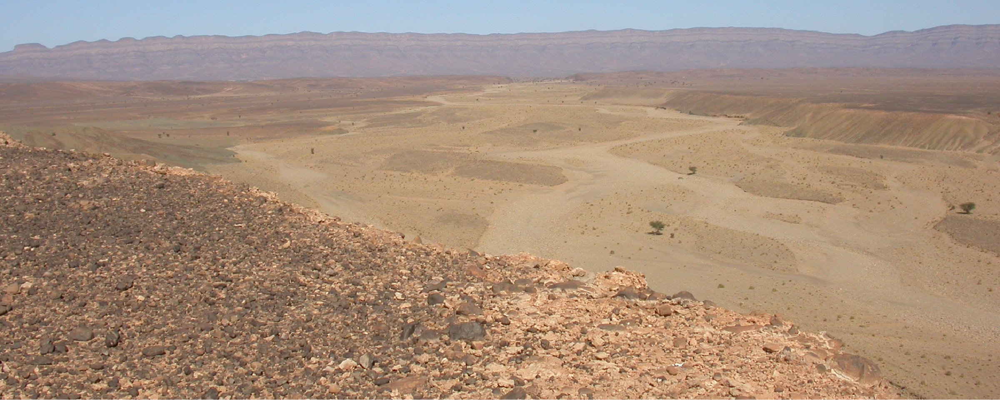

# GY4027 Assessment and Feedback

| Assessment | Due Date | % of module | Learning Outcomes |
| ----------- | ----------- | ----------- | ----------- |
| Assessment 1: StoryMap Virtual Field Trip | Friday 27 March | 50% | LOs 1-6 |
| Assessment 2: Written Exam | Saturday 09 May | 50% | LOs 1-6 |

## Assessment 1: StoryMap

**Due**: Friday 27 March

*50% of module*

> Using ArcGIS StoryMap and your own photos and videos, create a virtual field trip to describe and explain the evolution of a landscape of your choice

You should choose an area which you can go to, and take photos and/or videos of features from that area which show features such as:

- Rocks
- Weathering and erosional features
- Ongoing sediment transport
- Depositional features

You should use your photos / videos to cover:

- The role of Plate Tectonics and geological characteristics in shaping the landscape
- Which processes of weathering and erosion have been significant in shaping the landscape
- Which transport agents and surface processes have been significant in shaping the landscape

Your StoryMap will be assessed on these elements, and on the basis of:

- Your choice of landscape
- Your selection of photos / videos and other content
- Your StoryMap structure and other visual elements
- Your achievement of LO 5 "Display an appreciation of the scales of time and distance in landscape evolution"
- Your achievement of LO 6 "Acknowledge the dynamic nature of all landscapes and environments"

Note: The element of your choice of landscape does not imply that you need to cover a particularly unique landscape; there is no need to travel a very long distance to go somewhere new. You should be able to complete the assignment on an area around the University or at home. The element of choice here primarily depends on the size of the area you choose, and the features you are able to show. If you choose too small an area, it may not have sufficient features to fulfil all of the criteria. If you choose too large an area, you may not be able to cover everything needed to fulfill all of the criteria. The element of choice of landscape is assessing your judgement on this.

If you have sufficient photos / videos of your own from a particular place already (such as an area you have been to on a holiday), you may use those.

**Excluded areas:** The Burren and The Cliffs of Moher are specifically excluded as landscapes for this assignment.

You have previously created an ArcGIS StoryMap in the population Geography module, so it should be familiar - but here is a brief guide to [creating your ArcGIS StoryMap](./storymap.md).

**Grading Rubric:**

| Element | F | D | C | B | A |
| ----------- | ----------- | ----------- | ----------- | ----------- | ----------- |
| **Selection of landscape (10)** | Poor choice of landscape with little opportunity to explain landscape-shaping processes and landscape evolution *(0-2.5)* | Choice of landscape left insufficient opportunity to explain landscape-shaping processes and landscape evolution *(3-3.5)* | Choice of landscape gave some opportunity to explain some landscape-shaping processes and landscape evolution *(4-5)* | Well chosen landscape giving good opportunity to explain landscape-shaping processes and landscape evolution *(5.5-6.5)* | Excellent choice of landscapes provided strong opportunity to explain landscape-shaping processes and landscape evolution *(7-10)* |
| **Plate Tectonics and geological characteristics (10)** | Insufficient description of the role of plate tectonics and geological characteristics in shaping the landscape *(0-2.5)* | Minimal description of the role of plate tectonics and geological characteristics in shaping the landscape *(3-3.5)* | Some explanation of the role of plate tectonics and geological characteristics in shaping the landscape *(4-5)* | Good explanation of the significance of the role of plate tectonics and geological characteristics in shaping the landscape *(5.5-6.5)* | Excellent analysis of the role of plate tectonics and geological characteristics in shaping the landscape *(7-10)*  |
| **Weathering and erosion (10)** | Insufficient description of weathering and erosion *(0-2.5)* | Minimal description of relevant weathering and erosion *(3-3.5)* | Some explanation of weathering and erosion in the landscape *(4-5)* | Good explanation of how weathering and erosion shaped the landscape *(5.5-6.5)* | Excellent analysis of the role of weathering and erosion in shaping the landscape *(7-10)*  |
| **Transport Agents and Surface processes (30)** | Insufficient description of the transport agents and surface processes which shaped the landscape *(0-8.5)* | Minimal description of the transport agents and surface processes which shaped the landscape *(9-11.5)* | Some explanation of the transport agents and surface processes which shaped the landscape *(12-16)* | Good explanation of the transport agents and surface processes which shaped the landscape *(16.5-20.5)* | Excellent analysis of the transport agents and surface processes which shaped the landscape *(21-30)*  |
| **Your photos / videos and other content (20)** | Own photos / videos and other content insufficient or inadequate to illustrate processes and influences which shaped the landscape *(0-5.5)* | Minimal own photos / videos and other content to illustrate processes and influences which shaped the landscape *(6-7.5)* | Own photos / videos and other content illustrate some processes and influences which shaped the landscape *(8-10.5)* | Good range of own photos / videos and other content used well to illustrate processes and influences which shaped the landscape *(11-13.5)* | Excellent range of own photos / videos and other content used extremely effectively to illustrate processes and influences which shaped the landscape *(14-20)*  |
| **Structure and Visual Elements (5)** | Too short, or unacceptable structure or visual elements *(0-1)* | Structure or visual elements distract from the content; or quite short *(1.5)* | Significant improvements possible in structure or visual elements *(2-2.5)* | Acceptable structure and good visual elements *(3)* | StoryMap is well structured; visual elements excellently support narrative and content *(4-5)*  |
| **Selection and use of Sources (5)** | Sources inappropriate, and/or not useful, and/or not well used *(0-1)* | Few useful academic sources; or sources not well used *(1.5)* | Could have used more academic sources *(2-2.5)* | Good use of at least 5 academic sources *(3)* | Excellent use of 10+ well-chosen academic sources to support content *(4-5)* |
| **Appreciation of the scales of time and distance (5)** | Does not consider time and distance *(0-1)* | Minimal consideration of time and distance *(1.5)* | Some consideration of the scales of time and distance for the landscape *(2-2.5)* | Clear appreciation of the scales of time and distance for the landscape *(3)* | Excellent implicit or explicit appreciation of the scales of time and distance in the evolution of the landscape *(4-5)* |
| **Acknowledge the dynamic nature of all landscapes and environments (5)** | Does not acknowledge dynamic nature of landscapes *(0-1)* | Minimal consideration of dynamic nature of landscapes *(1.5)* | Acknowledges dynamic nature of landscapes *(2-2.5)* | Clear appreciation of the dynamic nature of landscapes *(3)* | Excellent implicit or explicit acknowledgement of the dynamic nature of landscapes *(4-5)* |

## Assessment 2: Written Exam

**Date**: 16:00 - 17:00 on Saturday 09 May 2026
**Location**: Schuman Building, Ground Floor: SG-15, SG-16, SG-17

*50% of module*

**Sample Exam**: [Sample Exam PDF](./assets/exam/GY4027_sample_exam_2026.pdf)

The written exam will comprise a mixture of short answer and essay questions to  assess your achievement of the learning outcomes across the entire content of the module, including laboratory work.

**Answer all questions in Section A**, which comprises 10 short questions worth 50% of the paper, covering the full breadth of the module content.

Questions 1-9 have between 2-6 marks each. These questions should need no more than one or two lines to answer (if your answers are longer than this, then either you have written too much or you have not identified the key points the questions are looking for). The mark values for each question reflect both the amount of information and the question difficulty - so a question worth 2 or 3 marks should be relatively easy and require only one or two key points in the answer; but a question worth 5 or 6 marks could either require several key points, or one or two key points which are judged to be higher difficulty.

Question 10 is worth 15 marks. Your answer to this question should be around half a page of average handwriting. As you might expect from the higher mark value, this is a more difficult question. However, the difficulty is not a case of "either you can answer it, or you can't"; rather, the difficulty lies in the complexity of the question, with marks being awarded depending on the depth of your analysis. To put it another way: I will be disappointed if anyone gets 0-5 marks on this question, I expect most people to get somewhere between 5-10 marks, and I would expect only a small number of answers to get between 10-15 out of 15.

**Answer ONE question in Section B**, worth 50% of the paper. These questions will allow you to demonstrate your achievement of the module learning outcomes in depth for a specific aspect of the module.

I would expect answers for these questions to be around 2 pages of average handwriting. Shorter answers may struggle to gain significant marks. 

The sample paper gives 6 example questions. The actual exam paper has 7 questions in this section. Given this range of choice, and similarly to Question 10, I would expect that everyone would at least be able to attempt one of the 7 questions, and be able to say enough to get 20+ marks from 50, with most people getting 25-35/50 - but getting 35+ marks will be difficult.

Bear in mind the generic marking scheme below - with the various options, it's not really possible to give a more specific grading rubric, but this certainly gives a good enough idea of how answers will be graded.

As you will see from the sample paper, none of the questions ask for specific facts or figures which can be memorised. Rather the questions explore your ability to describe, explain, and apply the big-picture concepts and processes. So, even if you don't remember a specific answer immediately for a question, you should be able to work it out.

**Work done in labs** is similarly not asked about specifically; i.e. there are no questions like "what was the grain size of Rock A in Week X?". However, each of the labs are relevant for one or more questions. **I expect everyone to use what you explored and learned in the labs to inform and support your answers** - for example using rock or sediment samples you examined in the labs as examples in your answers, or noting how observations you made in the labs support a particular concept.

You may bring ONE PAGE of notes into the exam. One side of an A4 page. It's up to you what to put on that page; whether that's written notes from lectures/labs, summaries for particular landscape settings, notes or examples from reading, or diagrams/maps. The main purpose of this is to reduce the pressure on you, so that you're not stressed about remembering details etc; if you are relying on the notes page so much that you need it all, it's very unlikely that you'd have time to answer all the questions fully. It's a safety blanket - good to have just in case, but hopefully you won't need it.

Knowledge/use of the Geologic Time Scale is not specifically required, so I wouldn't recommend including this on your one page.

**Generic Marking Scheme:**

| GRADE | % | Criteria |
| ----------- | ----------- | ----------- |
| **A1** | 80% | Exceptional answer which comprehensively addresses the question. Demonstrates ability to synthesize and analyse information well beyond that delivered in the module content. |
| **A2** | 70% | Excellent answer which comprehensively addresses the question. Demonstrates ability to interpret and evaluate information or concepts in depth with strong critical reasoning. Evidence of reading academic sources considerably beyond the module content. Well structured, with a high standard of writing. As good as can reasonably be expected. |
| **B1** | 65% | Superior answer with plenty of relevant material, based on the reading of academic sources exceeding the module content. Well written and structured but does not demonstrate quite as deep interpretation or evaluation of information or concepts, or critical reasoning, as students in the A range. Does not “make the material their own”. |
| **B2** | 60% | Very good answer with a lot of relevant material. More evidence of reading academic sources beyond the module content than a B3 student; but arguments not as well constructed as B1 work. |
| **B3** | 55% | Competently addresses the question. Demonstrates a good grasp of concepts, with clear evidence of some independent reading from academic sources beyond material covered in module content. |
| **C1** | 50% | Competently addresses the task. Demonstrates a good grasp of concepts. Includes all or most relevant points delivered in the module, but is based mainly on material covered in lectures/tutorials/laboratory classes; demonstrates little or no evidence of independent reading from academic sources. |
| **C2** | 45% | Addresses the task, but does not include all relevant points delivered in the module, or has some errors in understanding. Little or no evidence of any independent reading from academic sources. |
| **C3** | 40% | Addresses the question, but fails to include significant amounts of relevant points delivered in the module; or some good points are undermined by many inaccuracies or confusion on key concepts. |
| **D1** | 35% | Weak answer failing to reach the pass threshold. This will often be because of a failure to adequately address the task, i.e., insufficient relevant material. |
| **D2** | 30% | Very ‘thin’ answer. Student typically includes very little relevant content. Little or no evidence of more than general knowledge of the topic. |
| **F** | (<30%) | Answer reveals little evidence of engagement with the module content, and therefore does not merit the award of any modular credit. |

___

 [Module Home](./README.md)