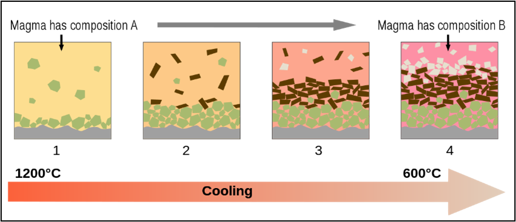
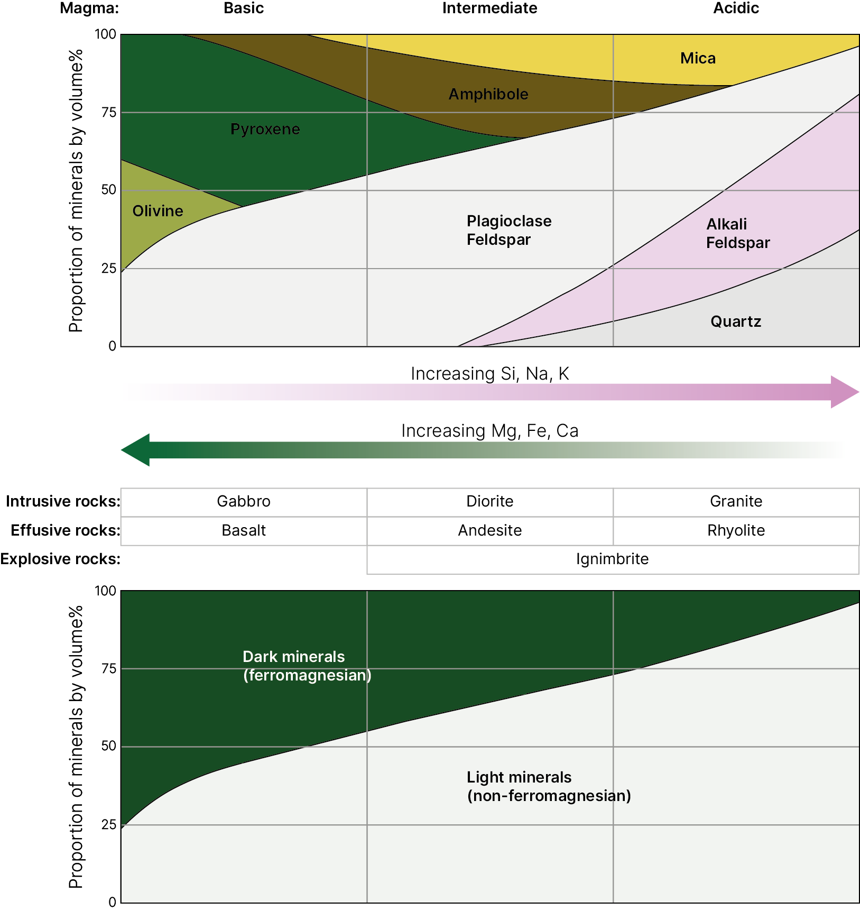
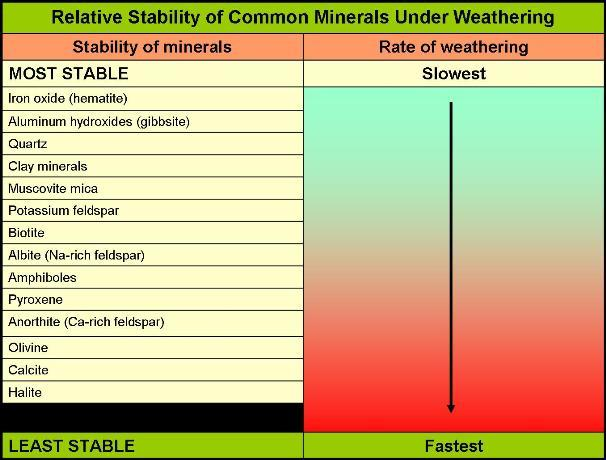
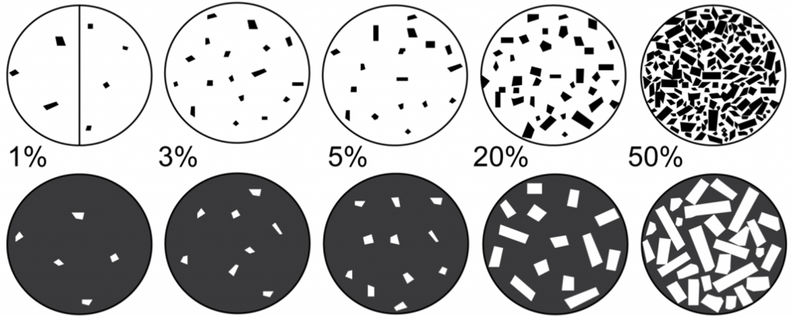
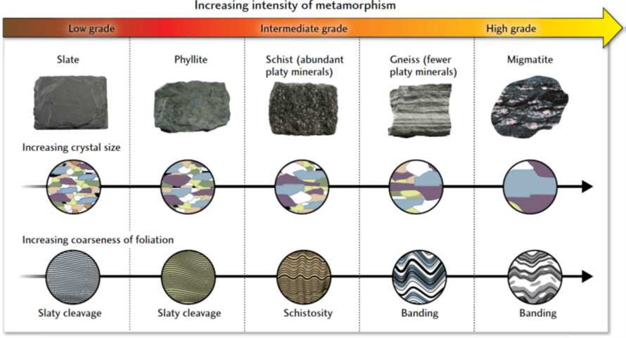

# Lab Exercise: Weathering and Erosion

In lectures, we have discussed some of the ways in which rocks are weathered and eroded. In today’s lab, we’re going to look at how a broad variety of rock types have been affected by weathering and erosion.

Broadly speaking, there are three different rock types: igneous rocks formed in volcanic system, either deep underground or on the Earth’s surface; sedimentary rocks formed from processes of weathering, erosion, transport, and deposition; and metamorphic rocks, formed from high pressure and/or temperatures being applied to existing rocks, changing them. We will look at two rocks from each of these broad categories.

## Igneous Rocks

Most igneous rocks start as what is known as basic magma, which is produced by partial melting of the Earth's mantle. You can think of this basic magma as the ‘normal’ or fresh magma.

Basic magma is hot – typically around 1300⁰C. From that temperature, it will cool until it forms solid rock. Rather than just freezing, it becomes solid rock through crystals growing from the liquid magma.

If the magma takes a long time to cool, the crystals can take a long time to grow, and will be large or coarse in size. If the magma cools very quickly, the crystals might be very fine – too small to see without a powerful microscope. So the texture of a rock can tell us something very important about how it formed.

Intrusive igneous rocks which form large batholiths underground - when an entire magma chamber solidifies - can take a very long time to cool, due to the small difference in temperature between the magma and the surrounding rocks. Minerals crystallising to form these rocks can take a very long time to grow, and so these rocks are generally formed of coarse crystals. This is referred to as a phaneritic texture.

Extrusive rocks, which are erupted from a volcano, cool very, very quickly – chilled by the surrounding cold land and air. Minerals crystallising in these rocks are generally too small to see. This is referred to as an aphanitic texture.

When basic magma is erupted onto the Earth's surface, from a volcano, the extrusive igneous rock which forms is calledbasalt - the most common igneous rockon the surface of Earth.

Where the same basic magma cools and crystallises underground in a magma chamber, the intrusive igneous rock which forms is called gabbro.

These have exactly the same composition - the only difference is the size of the crystals.

However, basalt and gabbro aren't the only kind of igneous rock, and it might be useful to explore a little of how igneous rocks with different compositions form.

As a basic magma cools in a magma chamber, solid minerals will be crystallising from the liquid magma, and falling to the bottom of the magma chamber. Importantly, these minerals do not have the same average composition as the magma itself.

The first minerals that crystallise will be ones which contain elements like iron and magnesium - you can think of these as elements which prefer to be in a solid crystalline mineral over being in a liquid magma.

As these iron-rich and magnesium-rich minerals crystallise, and fall to the bottom, the amount of iron and magnesium left in the liquid magma becomes smaller and smaller. This leaves the remaining liquid magma with a proportionately higher content of the elements which don’t crystallise as easily, like sodium, potassium, aluminium, and silicon. This is called fractional crystallisation.

The main effect of fractional crystallisation is that over time, as the magma cools, it changes from an iron- and magnesium-rich basic magma, to an iron- and magnesium-poor intermediate magma, and ultimately a silicon-rich acidic magma. Each of these types of magma has certain characteristic minerals which crystallise from it: olivine and pyroxene from basic magmas, amphiboles from intermediate magmas, and quartz from acidic magmas.

As well as fractional crystallisation, the high temperature of fresh basic magma is often hot enough to melt the rocks surrounding the magma chamber. Mixing this newly melted rock in with the magma is often enough to take a short-cut straight from basic to acidic.

Very generally, basic rocks tend to be dark in colour, and acidic rocks tend to be light in colour, with intermediate rocks somewhere in between. This doesn’t mean there are no dark minerals in acidic rocks, or light minerals in basic rocks – some mica is very dark in acidic rocks, and plagioclase feldspar is a while mineral in basic rocks – but there are far more dark minerals in the basic rocks, and far more lighter minerals in acidic rocks. The colour of the rock is therefore an important first guide to identifying it.

Why this matters for rock weathering is that the minerals which crystallise first from a liquid magma are typically the least stable at the surface of the Earth. Olivine and pyroxene will chemically weather quite rapidly once exposed at the Earth's surface, while quartz is extremely stable.

To explore igneous rock weathering, it's easier to look at examples with large crystals, so we'll stick to intrusive igneous rocks for today.

We have two intrusive rocks to examine. One basic rock - a gabbro from Carlingford in Co. Louth, and one acidic rock - a granite from Errisbeg in Connemara, Co. Galway.

### Task 1 - Weathering and erosion of Igneous Rocks

I'd like you to examine a sample of each of these rocks for indications of weathering and erosion. Keep a note of your answers to these questions - this content may be covered in the exam.

- For each rock, use the diagram below to estimate the percentages of light-coloured and dark-coloured minerals on a fresh, unweathered surface, and check if this matches what you'd expect based on the rock type from the diagram above.

- Try to identify any indications of chemical weathering in each rock, paying particular attention to whether this is affecting light or dark minerals. Can you see any preferential weathering of particular minerals?
- Can you see any evidence of mechanical weathering in each rock?
- Can you see any evidence of biological weathering in each rock?
- How far does evidence of weathering extend inside each of the the rocks from a weathered surface?
- What would you expect to remain or be produced from each rock after it has been entirely weathered?

## Metamorphic Rocks

Two factors control the composition of metamorphic rocks. One is the composition of the original rock; and the other is the conditions of metamorphism – how much pressure and temperature was applied to the rocks.

Rocks with distinctive compositions before metamorphism are relatively straightforward. Limestones which are metamorphosed become marbles – easily identified by their high calcite (calcium carbonate) content. Quartz-rich sandstones are metamorphosed to quartzite – easily identified by their high quartz content. Basic igneous rocks become amphibolites – with a distinct dark colour. Examining the composition of these rocks tells us what the original rock was.

However, for most metamorphic rocks, it is difficult to identify the original rock without a geological microscope – if not a precise chemical analysis. In these cases, examining their composition in hand specimen can’t tell us what the original rock was – but it can tell us something about the conditions of metamorphism. As pressure and temperature increases on a rock, different new minerals will grow sideways from the direction of pressure, initially forming indistinct flat surfaces, then “schist” layering, and eventually separating into distinct light and dark layers.

We have two metamorphic rocks to examine today. One is an amphibolite from south Connemara. One is a gneiss from Kilmore Quay in Wexford. This rock is around 1.5 billion years old, by the way – the oldest rock in the southeastern half of Ireland.

### Task 2 - Weathering of Metamorphic Rocks

I'd like you to examine a sample of each of these rocks for indications of weathering. Again, keep a note of your answers to the questions - this content may be covered in the exam.

- For each rock, use the percentages diagram above to estimate the percentages of light-coloured and dark-coloured minerals.
- For each rock, use the metamorphic diagram above to describe the texture of the rock - are the crystals smaller or larger, and is there any layering visible?
- Try to identify any indications of chemical weathering in each rock, paying particular attention to whether this is affecting light or dark minerals. Can you see any preferential weathering of particular minerals?
- Can you see any evidence of mechanical weathering in each rock?
- Can you see any evidence of biological weathering in each rock?
- How far does evidence of weathering extend inside each of the the rocks from a weathered surface, if visible?
- What would you expect to remain or be produced from each rock after it has been entirely weathered?
- How does weathering of these metamorphic rocks compare to weathering of the igneous rocks?

## Sedimentary Rocks

Sedimentary rocks can be broadly split into two categories – clastic sedimentary rocks, which are produced by weathering, erosion, transport, and deposition from existing rocks; and chemical sedimentary rocks, which are formed by creation of new sedimentary grains or precipitates. We’re only going to look at clastic rocks today, so we’ll focus on those.

There are a few key characteristics used in describing clastic sedimentary rocks:

- Grain size: The size of sedimentary grains can range from mud (smaller than 0.0039mm, which is 1/256th of a mm) to boulders (larger than 256 mm). The size of the grains can help distinguish the agent of transport: air cannot transport grains larger than fine grained sand over significant distances, and water requires extremely strong currents to transport grains larger than pebbles, while glaciers and gravity can transport even the largest blocks.
- Sorting: A well-sorted sediment is one where all the grains are approximately the same size. A poorly sorted sediment will have a wide range of sediment grain sizes. This is important for interpreting how a sediment was deposited as flow processes such as wind or water currents tend to sort sediment quite rapidly. As a flow slows down, the largest grains it carries are deposited, leaving a well-sorted deposit of that grain size. More rapid deposition, in which a flow slows significantly or stops entirely, will deposit all the sediment carried by that flow, leaving a poorly sorted sediment. This is essentially what happens with gravity and glacial deposition, which generally have very poorly sorted sediments.
- Rounding and Sphericity: Sediment which has just broken off a rock is usually quite angular, with sharp corners and edges, with a variety of shapes - blocky, platy, or elongated. As sediment is transported within a flow, grains will collide with each other and bounce off surfaces (e.g. a riverbed). These impacts tend to smooth off sharp corners and edges, becoming more rounded, and more spherical. The higher the energy of the flow, and the longer the distance of transport, the more the grains become more rounded and spherical. So, in general, angular sediment with low sphericity has been transported only a short distance – while rounded, highly spherical sediment must have had a long distance of transport. The main exception to this is in glaciers, where there is no grain-to-grain contact, as the sediment is separated by solid ice. Glacial sediments typically do not become more rounded or spherical with longer transport distances.
- Porosity/Matrix/Cement: These three characters are different answers to the same question: what is in between the grains? If the space in between the grains is, well, space, this is called porosity. If the space between grains is filled with smaller grains (usually silt or mud), this is called a matrix. If crystals have grown in the space between grains, this is called a cement. The presence of a matrix usually goes with poor sorting, and tells us something about the deposition. If there’s a high porosity or cement, that tells us that the rock did not undergo significant compaction, with the cement indicating fluids moving through the rock to form crystals, well after deposition.

We have three sedimentary rocks to examine today:

- a coarse grained sandstone from Rosroe in Co. Galway
- a fine grained sandstone from Booley Bay in Co. Wexford
- a mudstone or shale, also from Booley Bay in Co. Wexford. 

As with the previous specimens, we’ll make some general observations about the rock types first, and then consider how weathering has affected them. 

### Task 3 - Weathering of Sedimentary Rocks

I'd like you to examine a sample of each of these rocks for indications of weathering. Again, keep a note of your answers to the questions - there will be a link on Brightspace for you to submit your answers by next week.

- For each rock, use the sedimentary diagram above to describe the grain size, sorting, rounding and sphericity, and presence of porosity/matrix/cement.
- For each rock, can you see any difference in colour between fresh, unweathered surfaces, and the weathered surfaces?
- Can you see any indications of chemical weathering in each rock?
- Can you see any evidence of mechanical weathering in each rock?
- Can you see any evidence of biological weathering in each rock?
- How far does evidence of weathering extend inside each of the the rocks from a weathered surface, if visible?
- What would you expect to remain or be produced from each rock after it has been entirely weathered?
- How does weathering of these sedimentary rocks compare to weathering of the igneous and metamorphic rocks?

## Gravitational erosion

In the Erosion and Transport lecture, we discussed the concept of the Angle of Repose. This is the natural angle at which sediments will come to rest – and above which sediments will tend to start to move downslope.

### Task 4 - Angle of Repose

The Angle of Repose is not a constant, but varies depending on the grain size, and on the presence or absence of water.

You can do this exercise in groups. You are provided with four different sediments:

- Beach sand, Stromboli, Italy (dry)
- Beach sand, Carnsore Point, Co. Wexford (dry)
- River sand, Maigue, Co. Limerick (dry)
- River sand, Maigue, Co. Limerick (wet)

For each sediment, I would like you to do two things:

1. First, pour sediment out of the provided container into a clean tray, and measure the angle at which the sediment forms a slope (you can easily get an app for your phone to measure the angle by tilting your phone along the slope). This is the angle of repose.

2. Second, shake the tray gently until the sediment is forming a generally flat layer. Place the tray flat on the bench, then start to raise one end of the tray to tilt it at an angle. Measure the angle at which the sediment starts to move.  We'll refer to this as the angle of movement.

For each sediment, answer the following questions:

- Record the angle of repose
- Record the angle of movement
- Are the angle of repose and angle of movement the same? Why/why not?

Once you have completed all four sediments, you should be able to answer the following general questions:

- What difference does grain size make to the angle of repose?
- How does adding water to a sediment affect the angle of repose?
- Why do landslides happen?

___

[Module Home](./README.md) | [Labs](./labs.md)