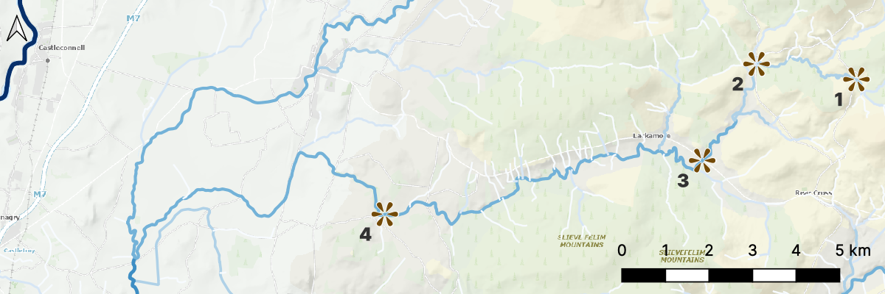

# Lab Exercise: Fluvial and Glacial Rocks and Sediments

If we want to understand how rivers shape landscapes, it's worth looking at sediments deposited by rivers, and rocks formed from river sediments. This will help us to understand how rivers transport and deposit sediment, and what happens to that sediment as it's transported and deposited.

In Week 6, we discussed glacial environments - and it's very much also worth looking at glacial sediments and rocks. Not only because this will help us to understand how glaciers transport and deposit sediment; but also because the contrast between fluvial and glacial sediments will help us to even better understand what's happening in both river and glacial settings.

So, in this week's lab, we'll look at some sediments and rocks from both fluvial and glacial sediments.

## Sedimentary Rocks

We looked a some sedimentary rocks in the Weathering and Erosion lab, and it's worth repeating some of the background about clastic sediments and sedimentary rocks here, for ease of reference.

There are a few key characteristics used in describing clastic sediments and sedimentary rocks:

**Grain size:** The size of sedimentary grains can range from mud (smaller than 0.0039mm, which is 1/256th of a mm) to boulders (larger than 256 mm). The size of the grains can help distinguish the agent of transport:
- Air cannot transport grains larger than fine grained sand over significant distances.
- Water requires extremely strong currents to transport grains larger than pebbles.
- Glaciers can transport grains of all sizes, easily moving ‘grains’ which could be carried only by the strongest of water flows.
- Gravity can transport grains of all sizes, but typically tends towards the larger end, as the distance of transport is usually not long enough to break sediment down to the smallest sizes.

Bear in mind that weathering does not stop when sediment is removed from rock. Weathering continues throughout the erosion and transport process, mechanically breaking grains down to smaller sizes, and chemically weathering parts of grains.

**Sorting:** A well-sorted sediment is one where all the grains are approximately the same size. A poorly sorted sediment will have a wide range of sediment grain sizes.

This is important for interpreting how a sediment was deposited as flow processes such as wind or water currents tend to sort sediment quite rapidly. As a flow slows down, the largest grains it carries are deposited, leaving a well-sorted deposit of that grain size. More rapid deposition, in which a flow slows significantly or stops entirely, will deposit all the sediment carried by that flow, leaving a poorly sorted sediment.
- Air typically leaves very well sorted deposits
- Water generally leaves sediments with sorting poorer than air, because flow speeds and sediment size can vary over a much larger range. Typically, when larger grains are deposited, smaller grains remain in suspension, so there’s rarely a full continuum of grain sizes from clay all the way up, even in the most poorly sorted deposits.
- Glaciers typically deposit everything on melting, which means they do typically have the full range of grain sizes from clay all the way up, extremely poor sorting.
- Gravity sediments are usually poorly sorted, and smaller grains can often get removed from gravity deposits by wind or water.

**Rounding and Sphericity:** Sediment which has just broken off a rock is usually quite angular, with sharp corners and edges, with a variety of shapes - blocky, platy, or elongated. As sediment is transported within a flow, grains will collide with each other and bounce off surfaces (e.g. a riverbed). These impacts tend to smooth off sharp corners and edges, becoming more rounded, and more spherical.

The higher the energy of the flow, and the longer the distance of transport, the more the grains become more rounded and spherical. So, in general, angular sediment with low sphericity has been transported only a short distance – while rounded, highly spherical sediment must have had a long distance of transport. The main exception to this is in glaciers, where there is no grain-to-grain contact, as the sediment is separated by solid ice. Glacial sediments typically do not become more rounded or spherical with longer transport distances.

**Porosity/Matrix/Cement (rocks only):** These three characters are different answers to the same question: what is in between the grains? If the space in between the grains is, well, space, this is called porosity. If the space between grains is filled with smaller grains (usually silt or mud), this is called a matrix. If crystals have grown in the space between grains, this is called a cement. The presence of a matrix usually goes with poor sorting, and tells us something about the deposition. If there’s a high porosity or cement, that tells us that the rock did not undergo significant compaction, with the cement indicating fluids moving through the rock to form crystals, well after deposition.

It's also worth adding one more characteristic which we didn't consider in the Weathering and Erosion lab:

**Provenance:** A sediment from a single source is called monomict; a sediment produced from multiples sources is called polymict. Distinguishing the types of sediment can help to interpret the distance and agents of transport. For example, a mountain slope rock fall from a single outcrop will generally have one type of sediment – whatever that outcrop was made of. A river which flows over a long distance can have several different types of sediment – perhaps some well-rounded grains from a source near to the start of the flow, and some more angular grains from rocks eroded during transport. A glacier can pick up sediment from a very wide area, all of which will likely have similar angularity and sphericity.

## Task 1 - Fluvial sediments

There are four sediments labelled A, B, C, and D in grey trays at the back of the lab. These four sediments come different parts of the same river system.

Your task is to describe the sediments, and to determine which sediment comes from which location.

For each of the four sediments, you should examine it in the tray (please don't move the trays or remove sediment from the trays) and describe:

- the grain size (the largest category present)
- where it falls on the scale from poorly-sorted to well-sorted
- rounding and sphericity of the grains

Using these descriptions, you should be able to answer which of the sediments comes from each of locations 1, 2, 3, and 4 on the map above.

## Task 2: Fluvial and Glacial Sediments

You have three sediments to examine. Your task is to describe the sediments, and to determine whether each one is a fluvial or glacial sediment.

For each of the three sediments, you should examine it (with the aid of the microscopes) and describe:

- the grain size (the largest category present)
- where it falls on the scale from poorly-sorted to well-sorted
- rounding and sphericity of the grains
- if the provenance is monomict or polymict

Using these descriptions, you should be able to answer these two questions for each sediment:

- How have weathering and erosion affected the sediment since transport began?
- Was this sediment from a fluvial or glacial setting, and what observations led you to this conclusion?

## Task 3: Fluvial and Glacial Sedimentary Rocks

You have three clastic sedimentary rocks to examine. Your task is to describe the rocks, and to determine whether each one is a fluvial or glacial sedimentary rock.

For each of the three sedimentary rocks, you should examine it (with the aid of the microscopes where possible) and describe:

- the grain size (the largest category present)
- where it falls on the scale from poorly-sorted to well-sorted
- rounding and sphericity of the grains
- Whether there is porosity, matrix, or cement present
- if the provenance is monomict or polymict

Using these descriptions, you should be able to answer this question for each of the sedimentary rocks:

- Was this sedimentary rocks deposited in a fluvial or glacial setting, and what observations led you to this conclusion?

___

[Module Home](./README.md) | [Labs](./labs.md)