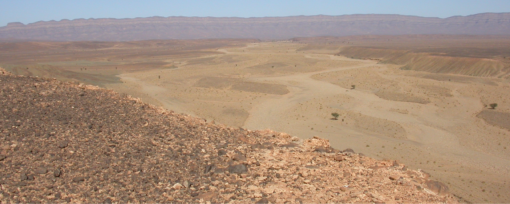
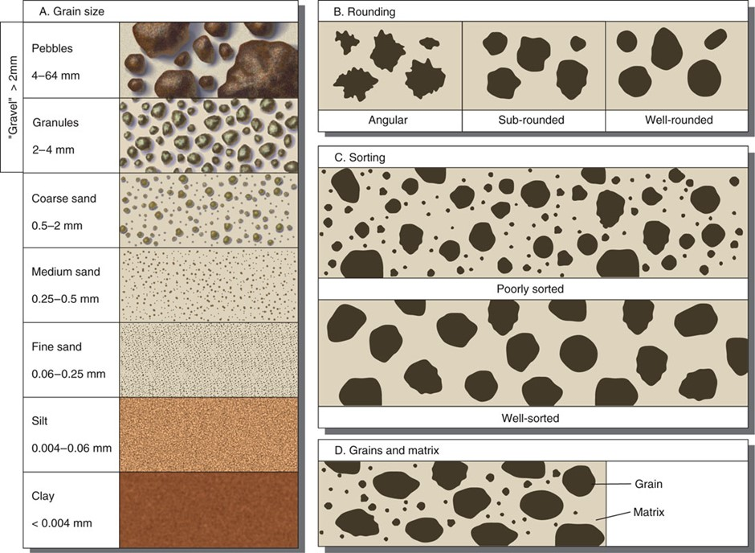

# Lab Exercise: Coastal and Aeolian Rocks and Sediments
In the previous lab, we looked at rocks and sediments deposited by rivers and glaciers, to help us to better understand the processes of weathering and erosion, transport, and deposition in both fluvial and glacial environments and landscapes.

In this week's lab, we'll take a similar approach, and look at rocks and sediments from coastal and aeolian settings.

## Sedimentary Rocks

Once again it's worth repeating some of the background about clastic sediments and sedimentary rocks here, for ease of reference.

There are a few key characteristics used in describing clastic sediments and sedimentary rocks:

**Grain size:** The size of sedimentary grains can range from mud (smaller than 0.0039mm, which is 1/256th of a mm) to boulders (larger than 256 mm). The size of the grains can help distinguish the agent of transport:
- Air cannot transport grains larger than fine grained sand over significant distances.
- Water requires extremely strong currents to transport grains larger than pebbles.
- Glaciers can transport grains of all sizes, easily moving ‘grains’ which could be carried only by the strongest of water flows.
- Gravity can transport grains of all sizes, but typically tends towards the larger end, as the distance of transport is usually not long enough to break sediment down to the smallest sizes.

Bear in mind that weathering does not stop when sediment is removed from rock. Weathering continues throughout the erosion and transport process, mechanically breaking grains down to smaller sizes, and chemically weathering parts of grains.

**Sorting:** A well-sorted sediment is one where all the grains are approximately the same size. A poorly sorted sediment will have a wide range of sediment grain sizes.

This is important for interpreting how a sediment was deposited as flow processes such as wind or water currents tend to sort sediment quite rapidly. As a flow slows down, the largest grains it carries are deposited, leaving a well-sorted deposit of that grain size. More rapid deposition, in which a flow slows significantly or stops entirely, will deposit all the sediment carried by that flow, leaving a poorly sorted sediment.
- Air typically leaves very well sorted deposits
- Water generally leaves sediments with sorting poorer than air, because flow speeds and sediment size can vary over a much larger range. Typically, when larger grains are deposited, smaller grains remain in suspension, so there’s rarely a full continuum of grain sizes from clay all the way up, even in the most poorly sorted deposits.
- Glaciers typically deposit everything on melting, which means they do typically have the full range of grain sizes from clay all the way up, extremely poor sorting.
- Gravity sediments are usually poorly sorted, and smaller grains can often get removed from gravity deposits by wind or water.

**Rounding and Sphericity:** Sediment which has just broken off a rock is usually quite angular, with sharp corners and edges, with a variety of shapes - blocky, platy, or elongated. As sediment is transported within a flow, grains will collide with each other and bounce off surfaces (e.g. a riverbed). These impacts tend to smooth off sharp corners and edges, becoming more rounded, and more spherical.

The higher the energy of the flow, and the longer the distance of transport, the more the grains become more rounded and spherical. So, in general, angular sediment with low sphericity has been transported only a short distance – while rounded, highly spherical sediment must have had a long distance of transport. The main exception to this is in glaciers, where there is no grain-to-grain contact, as the sediment is separated by solid ice. Glacial sediments typically do not become more rounded or spherical with longer transport distances.

**Porosity/Matrix/Cement (rocks only):** These three characters are different answers to the same question: what is in between the grains? If the space in between the grains is, well, space, this is called porosity. If the space between grains is filled with smaller grains (usually silt or mud), this is called a matrix. If crystals have grown in the space between grains, this is called a cement. The presence of a matrix usually goes with poor sorting, and tells us something about the deposition. If there’s a high porosity or cement, that tells us that the rock did not undergo significant compaction, with the cement indicating fluids moving through the rock to form crystals, well after deposition.

**Provenance:** A sediment from a single source is called monomict; a sediment produced from multiples sources is called polymict. Distinguishing the types of sediment can help to interpret the distance and agents of transport. For example, a mountain slope rock fall from a single outcrop will generally have one type of sediment – whatever that outcrop was made of. A river which flows over a long distance can have several different types of sediment – perhaps some well-rounded grains from a source near to the start of the flow, and some more angular grains from rocks eroded during transport. A glacier can pick up sediment from a very wide area, all of which will likely have similar angularity and sphericity.

I would like to introduce one new concept for this week:

**Maturity:** We can summarise some of the characteristics of sediments discussed above in the overall concept of sediment maturity.

Immature sediments are new sediments, in which the grains have been formed or eroded from rock more recently, and so have not gone through all the changes which happen to sediments over long distances and times of transport.. These will generally be poorly sorted, with a range of grain sizes, since they haven’t had long to be broken down to smaller grains; the grains will also generally have a variety of shapes, and angular surfaces with sharp corners and edges. The grains will also include more fragile or easily eroded components, for example shell material, or minerals like feldspar or mica (that’s the very flat shiny one).

Sediments become more mature as they are transported for more time or over longer distances. Over this time and/or distance, the grains will become smaller; they’ll become more spherical in shape with smoother rounded surfaces, and the fragile or easily eroded grains like shells and mica will be broken down completely and disappear.

Mature sediments are then old sediments, which have been sediments for a long time, which have been transported for a long time over long distances, and have gone through those changes to the point where there’s really not much more to change. They are generally composed of only well sorted, well rounded, mostly spherical grains of resistant minerals like quartz.

So, immature sediments have grains which are more angular, less spherical, more poorly sorted, and of a variety of grain types; while mature sediment are more rounded, more spherical, well sorted, and with the less stable grains chemically weathered such that only harder grains like quartz remain.
- Air typically leaves very mature sediments, as grains are repeatedly moved for short distances over long timescales - but aeolian sediments can also have lower maturity if new sediment is added.
- Water can deposit sediments of all maturity levels, depending on how long the sediment has been transported. Upland rivers tend to have very immature sediments, and even the largest and longest rivers tend to have at most moderately mature sediment; but in coastal settings where sediments can be repeatedly moved short distances over long time periods by local currents, storms, and waves, some sediments can become extremely mature - especially if there's limited supply of additional sediment.
- Glaciers typically have very little weathering and erosion of sediment as it is transported, and deposit everything on melting; so glacial sediments tend to be very immature.
- Gravity sediments are usually very immature, having been moved only a short distance from their source.

**Reference samples**
In addition to the sediments and rocks which you have to examine, describe, and determine the setting for, we're also providing you this week with some reference samples. There's one reference sediment sample from different examples of each of the three settings you have to describe samples from, plus two sediments you've seen in a previous lab:

- A coastal dune sand from Ballyheigue, Co. Kerry
- An estuarine beach sand from Harrylock, Co. Wexford (Waterford Harbour estuary)
- A strandplain beach sand from Kilmore Quay, Co. Wexford
- Beach sediment from Owey Island, Co. Donegal
- Storm beach sediment from Carnsore Point, Co. Wexford

There's also one reference rock:

- Distal (offshore) delta from Doonaha, Co. Clare

You don't have to describe or answer questions about these; they're provided so that you have some basis for comparison to help you when you're examining the specimens for the tasks, and just to let you see a wider range of samples without necessarily having to describe everything in detail.

## Task 1: Coastal and Aeolian Sediments

You have seven sediments to examine, from coastal and aeolian settings: two aeolian dune sands, two estuarine beach sands, and three strandplain beach sands. Your task is to describe the sediments, and to determine which setting each is from: dune, estuary beach, or strandplain beach.

For each of the seven sediments, you should examine it (with the aid of the microscopes) and describe:

- the grain size (the largest category present)
- where it falls on the scale from poorly-sorted to well-sorted
- rounding and sphericity of the grains
- if the provenance is monomict or polymict

Using these descriptions:

1. How mature is each sediment, on a scale from 'very mature' to 'very immature'?
2. Rank the 7 sediments in order of maturity, from most immature to most mature.
3. Finally, you should be able to determine: was this sediment from an aeolian dune, estuarine beach, or strandplain beach setting, and what observations led you to this conclusion?

## Task 2: Coastal and Aeolian Sedimentary Rocks

You have four sedimentary rocks to examine, from coastal and aeolian settings: one from an aeolian dune, one from a delta, one from a coastal lagoon, and one from an open marine coast. Your task is to describe the rocks, and to determine which setting each is from.

For each of the four sedimentary rocks, you should examine it (with the aid of the microscopes where possible) and describe:

- the grain size (the largest category present)
- where it falls on the scale from poorly-sorted to well-sorted
- rounding and sphericity of the grains
- Whether there is porosity, matrix, or cement present
- if the provenance is monomict or polymict

Using these descriptions, you should be able to answer this question for each of the sedimentary rocks:

1. Was this sedimentary rock deposited in an aeolian dune, delta, coastal lagoon, or open marine coastal setting, and what observations led you to this conclusion?

___

[Module Home](./README.md) | [Labs](./labs.md)