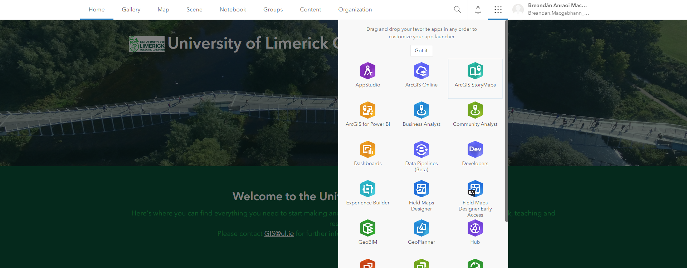
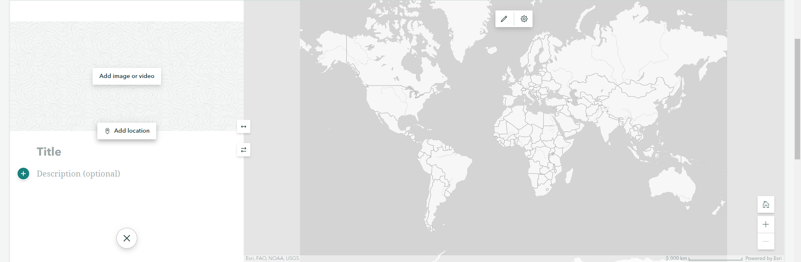
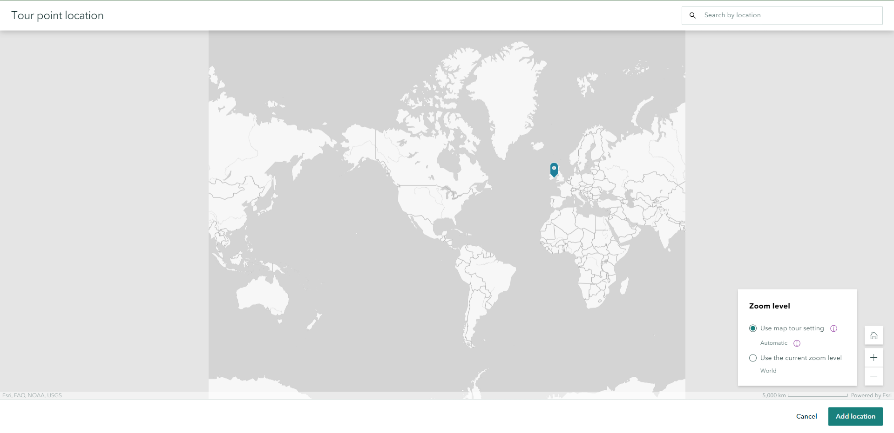
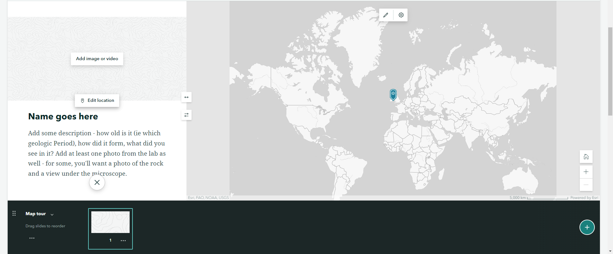

# Creating your ArcGIS StoryMap

Go to [https://uolimerick.maps.arcgis.com/](https://uolimerick.maps.arcgis.com/) and login.

(If you do not have a login, please contact me)

In the top menu bar, click the button with 9 dots, which opens the menu of available applications. In that menu, choose ArcGIS StoryMaps.

Click the New Story button. I recommend choosing the Explorer Map Tour option, where viewers will be able to click between different points on the map at will, and see what you have at each location. This fits well with your task to create a StoryMap which uses images/video of locations in an area to explain the processses which have been significant in the evolution of the landscape. 

(However, if you have an idea for a different style of StoryMap for the same task, feel free).

Give your StoryMap a title - this will automatically rename it, and it saves automatically as well. 

Then it's time to start adding your content to the map. Click on Untitled Tour Point to add your first. Give it a title, add some description; and click on the Add image or video button to add photos or videos from your first location, to show features relevant to the evolution of the landscape at this point.

The important step - click the Add location button to add where it came from. Zoom to it's location, and click on the map to select a point. Here, you can choose how viewers will see the point - do you want to leave the zoom as automatic, or do you want to specify the zoom level? If so, zoom to a view you're happy with and select the Use the current zoom level option. Click Add location bottom right when you're happy.

That's your first added! You'll now see it listed along the bottom in the Map tour section. To continue adding points, click the green plus button at the right side of the Map tour section. And keep going!

