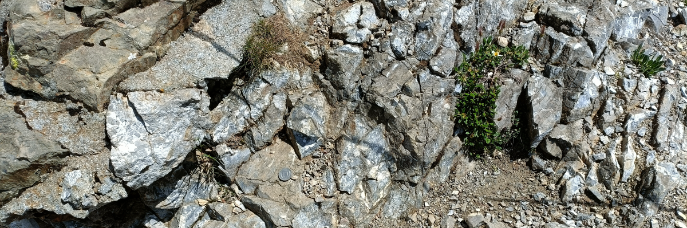

# Week 1: Weathering and Erosion

Landscapes are largely made of rocks, sediments, and soils. Natural forces shape the landscape by modifying existing rocks, sediment, and soils. This week's lecture will take a closer look at the processes of weathering, some of the geographic factors that control these processes, and some of the landforms they produce.

By the end of this week you should be able to:
1. Explain common mechanical, chemical, and biological weathering processes
2. Describe the products of weathering
3. Explain some of the geographic controls on weathering

This section will contain lecture slides and the assigned reading for the week.

- [ ]  Lecture
- [ ]  Reading - Huggett chapters 1, 7
- [ ]  Additional reading - papers by Shtober-Zisu and Wittenberg (2021), and Castro *et al.* (2020)

## Lecture

Lecture Monday 0900-1000, C1-059

Lecture slides: [GY4027 L1 Weathering and Erosion](./assets/lectures/GY4027_L1_Weathering_and_Erosion.pdf)

## Labs

No lab this week - labs will start in Week 3/4

## Reading

### Module textbook

I would like you to read Chapter One and Chapter Seven of Huggett, R. (2017) Fundamentals of Geomorphology, 4th Edition. Routledge, London.

Chapter One is not covered in the lecture - it is intended as a broader introduction to geomorphology. Chapter Seven is the chapter on erosion.

Available [online](https://archive.org/details/routledgefundamentalsofphysical/) or via the Glucksman Library.

### Academic papers

*Every week I'll also be giving you at least one paper from an academic journal to read. These papers will extend beyond the content of the lecture, giving examples of applying the principles we're discussing. You have to get used now to reading beyond the topic of the lecture - remember, 6 credits equates to 120 hours of work over the semester, of which you get 11 hours of lectures, and 10 hours of labs. That leaves 99 hours of independent work, approximately 8 hours per week. The lectures should be an introduction - even the reading I assign should just be an extended introduction.*

- Shtober-Zisu, N. and Wittenberg, L. 2021 Long-term effects of wildfire on rock weathering and soil stoniness in the Mediterranean landscapes. *Science of The Total Environment* **762**, 143125. doi: [10.1016/j.scitotenv.2020.143125](https://doi.org/10.1016/j.scitotenv.2020.143125)

- Castro, J.M., Keller, F., Feisel, Y., Lanari, P., Helo, C., Mueller, S.P., Schipper, C.I., and Thomas, C. 2020 Lightning-induced weathering of Cascadian volcanic peaks. *Earth and Planetary Science Letters* **552**, 116595. doi: [10.1016/j.epsl.2020.116595](https://doi.org/10.1016/j.epsl.2020.116595)

This is a really nice recent paper which considers the impact of wildfires on rock weathering - not something I discussed in the lecture, and I'm hoping it just makes you think a little more about some of the factors which control weathering.

### Optional additional reading

One of the formative papers in this topic is

- Goldich, S.S. 1938 A Study in Rock-Weathering. *The Journal of Geology* **46**, 17–58. doi: [10.1086/624619](https://doi.org/10.1086/624619)

You certainly don't need to read the entire paper in detail - I don't think it's particularly a good use of your time to learn everything you'd need to fully understand the entire paper. But an ovverview read could absolutely be useful to get an idea of the broad fundamental concepts of how and why different minerals weather differently - as well as an insight into how much/little we knew in the past, especially if you then compare it to something like

- Bufe, A., Rugenstein, J.K.C. and Hovius, N. 2024 CO~2~ drawdown from weathering is maximized at moderate erosion rates. *Science* **383**, 1075-1080. doi: [10.1126/science.adk0957](https://doi.org/10.1126/science.adk0957)

which used global datasets to explore how different erosion rates can affect the global climate. Papers in *Science* are high impact research written for a more general audience, this one is definitely worth a look.

### Extras

In the lecture I compared freeze-thaw fracturing of rocks to trees exploding in cold snaps, and mentioned Instagram reels from the ongoing cold snap in North America - here's a couple:

[Franklin, Tennessee](https://www.instagram.com/reel/DT82v3cD7C-)

[Nashville, Tennessee](https://www.instagram.com/reel/DT8lX7Rkm7P)