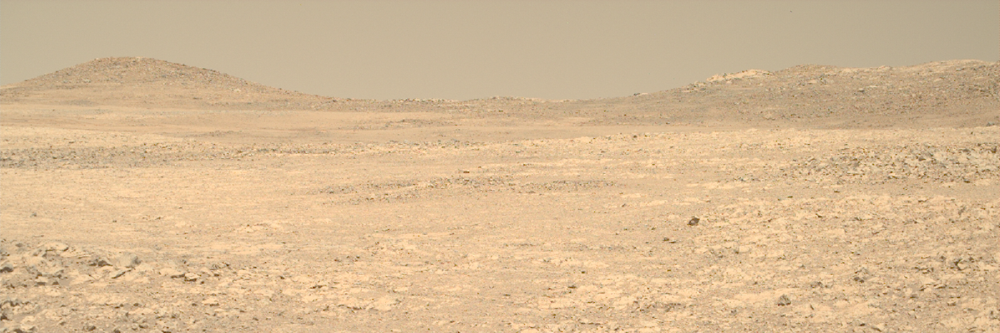

# Week 11: Planetary Landscapes

This week, we'll return to a topic introduced in the reading for Week 2 - landscapes on other planets and moons.

By the end of this week you should be able to:
1. Explain how gravitational processes can be different in different gravity
2. Explain how aeolian processes can be different in different atmospheres
3. Explain how liquid processes can be different with a different liquid than water
4. Explain how ice processes can be different with different ice than water ice

This section will contain lecture slides and the assigned reading for the week.

- [ ] Lecture
- [ ] Lab - Group 2B
- [ ] Reading - no chapter this week
- [ ] Additional reading - paper by Diniega *et al.* 2021

## Lecture

Lecture Monday 0900-1000, C1-059

Lecture slides: [GY4027 L11 Planetary Landscapes](./assets/lectures/GY4027_L11_Extraterrestrial_Landscapes.pdf)

## Labs

LAB GROUP 2B: Friday 1100-1300 in ER2-029

## Reading

### Module textbook

No chapter this week

### Academic papers

*Every week I'll also be giving you at least one paper from an academic journal to read. These papers will extend beyond the content of the lecture, giving examples of applying the principles we're discussing. You have to get used now to reading beyond the topic of the lecture - remember, 6 credits equates to 120 hours of work over the semester, of which you get 11 hours of lectures, and 10 hours of labs. That leaves 99 hours of independent work, approximately 8 hours per week. The lectures should be an introduction - even the reading I assign should just be an extended introduction.*

- Diniega, S., Bramson, A.M., Buratti, B., Buhler, P., Burr, D.M., Chojnacki, M., Conway, S.J., Dundas, C.M., Hansen, C.J., McEwen, A.S., Lapôtre, M.G.A., Levy, J., Mc Keown, L., Piqueux, S., Portyankina, G., Swann, C., Titus, T.N., and Widmer, J.M. 2021. Modern Mars' geomorphological activity, driven by wind, frost, and gravity. *Geomorphology* **380**, 107627. doi: [10.1016/j.geomorph.2021.107627](https://doi.org/10.1016/j.geomorph.2021.107627)

This paper reviews the landscape-shaping processes on modern-day Mars. This is useful not just because Mars is interesting in itself, but also because the contrast with Earth - with different gravity, different atmosphere, lack of water, and different ice - will help to understand the processes shaping landscapes here on Earth.