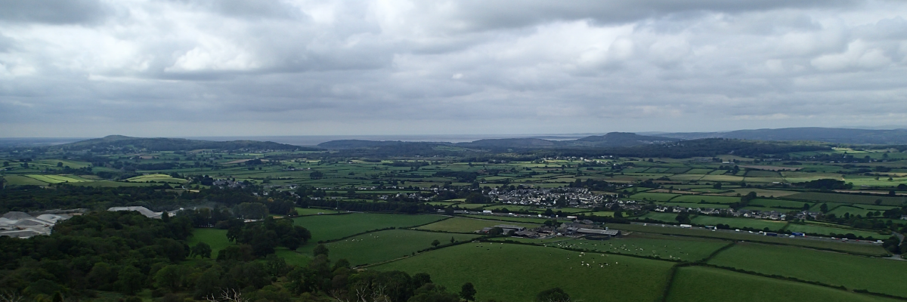

# Week 12: Anthropogenic Landscapes

In this final week of the module, we will look at Human influence on the landscape.

By the end of this week you should be able to:
1. Describe a range of anthropogenic landscapes
2. Explain the hydrological impacts of some anthropogenic landscapes
3. Discuss the environmental consequences of some anthropogenic landscapes

This section will contain lecture slides and the assigned reading for the week.

- [ ]  Lecture
- [ ]  Lab - Group 2A
- [ ]  Reading - Szabó *et al.* chapter 17
- [ ]  Additional reading - papers by 

## Lecture

Lecture Monday 0900-1000, C1-059

Lecture slides: [GY4027 L12 Anthropogenic Landscapes](./assets/lectures/GY4027_L12_Anthropogenic_Landscapes.pdf)

## Labs

LAB GROUP 2A: Friday 1100-1300 in ER2-029

## Reading

### Module textbook

I would like you to read Chapter 17 of Szabó, J., Dávid, L., and Lóczy, D. *eds*. 2010. *Anthropogenic Geomorphology A Guide to Man-Made Landforms*. Springer, Dordrecht.

This is a summary chapter on anthropogenic landscapes. I highly recommend at least skimming through other chapters of this book as well.

Available via the Glucksman Library.

### Academic papers

*Every week I'll also be giving you at least one paper from an academic journal to read. These papers will extend beyond the content of the lecture, giving examples of applying the principles we're discussing. You have to get used now to reading beyond the topic of the lecture - remember, 6 credits equates to 120 hours of work over the semester, of which you get 11 hours of lectures, and 10 hours of labs. That leaves 99 hours of independent work, approximately 8 hours per week. The lectures should be an introduction - even the reading I assign should just be an extended introduction.*

- Hooke, R.L. 1994 On the efficacy of humans as geomorphic agents. *GSA Today* **4**, 217–225 [download pdf](https://rock.geosociety.org/gsatoday/archive/4/9/pdf/i1052-5173-4-9-sci.pdf)

What moves more material - rivers, or people?

- Del Monte, M., D’Orefice, M., Luberti, G. M., Marini, R., Pica, A., & Vergari, F. 2016 Geomorphological classification of urban landscapes: the case study of Rome (Italy). *Journal of Maps* **12**, 178–189. doi: [10.1080/17445647.2016.1187977](https://doi.org/10.1080/17445647.2016.1187977)

Anthropogenic impacts on the landscape aren't new - in some places they've been happening for thousands of years.

- Hupy, J.P. and Koehler, T. 2012 Modern warfare as a significant form of zoogeomorphic disturbance upon the landscape. *Geomorphology* **157–158**, 169-182. doi: [10.1016/j.geomorph.2011.05.024](https://doi.org/10.1016/j.geomorph.2011.05.024)

It's not just the everyday human activity which modifies the landscape.