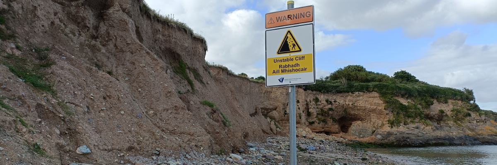

# Week 2: Erosion and Transport

The landscape is shaped by moving material around. This week, we consider the four agents of erosion and transport: gravity, water, ice, and air.

By the end of this week you should be able to:
1. List the four principal transport agents
2. Describe how gravity erodes and transports materials
3. Describe how water erodes and transports materials
4. Describe how ice erodes and transports materials
5. Describe how air erodes and transports materials

This section will contain lecture slides and the assigned reading for the week.

- [ ] Lecture (ONLINE)
- [ ] Reading - Huggett chapter 3
- [ ] Additional reading - papers by Baker et al. 2018, Burr et al. 2006, Howard et al. 2017, and Krohn et al. 2014

## Lecture

Lecture ONLINE due to bank holiday

Lecture slides: [GY4027 L2 Erosion and Transport](./assets/lectures/GY4027_L2_Erosion_and_Transport.pdf)

## Labs

No lab this week - labs will start in Week 3/4

## Reading

### Module textbook

I would like you to read Chapter Three of Huggett, R. (2017) Fundamentals of Geomorphology, 4th Edition. Routledge, London.

Chapter Three is the chapter on reconstructing the geomorphological history of an area. This is a different topic to that covered in the lecture, but I think it will help you to understand the papers assigned as additional reading.

Available [online](https://archive.org/details/routledgefundamentalsofphysical/) or via the Glucksman Library.

### Academic papers

*Every week I'll also be giving you at least one paper from an academic journal to read. These papers will extend beyond the content of the lecture, giving examples of applying the principles we're discussing. You have to get used now to reading beyond the topic of the lecture - remember, 6 credits equates to 120 hours of work over the semester, of which you get 11 hours of lectures, and 10 hours of labs. That leaves 99 hours of independent work, approximately 8 hours per week. The lectures should be an introduction - even the reading I assign should just be an extended introduction.*

- Baker, M.M., Newman, C.E., Lapotre, M.G.A., Sullivan, R., Bridges, N.T., and Lewis, K.W. 2018. Coarse sediment transport in the modern Martian environment. *Journal of Geophysical Research: Planets* **123**, 1380–1394. doi: [10.1002/2017JE005513](https://doi.org/10.1002/2017JE005513)

There's little that will help to understand processes we take for granted more than changing some of the fundamentals of those processes. So, I would like you to read this paper on aeolian sediment transport on Mars. Different atmospheric pressure, different gravity. Some of it is a bit complex, but I think it will really help you to understand the processes of aeolian sediment transport on Earth.

- Burr, D.M., Emery, J.P., Lorenz, R.D., Collins, G.C., and Carling, P.A. 2006. Sediment transport by liquid surficial flow: application to Titan. *Icarus* **181**, 235–242. doi: [10.1016/j.icarus.2005.11.012](https://doi.org/10.1016/j.icarus.2005.11.012)

Same idea as above. There's only two bodies in the solar system with liquid on the surface: Earth, and Saturn's moon Titan. Let's see how liquid sediment transport works on Titan. By the way, note I said 'liquid' there. It's not water.

PS - IGNORE THE MATHS. Unless you're really into it. Just assume they're right about all the equations. But do try to understand what they're concluding from the maths.

- Howard, A.D., Moore, J.M., Umurhan, O.M., White, O.L., Anderson, R.S., McKinnon, W.B., Spencer, J.R., Schenk, P.M., Beyer, R.A., Stern, S.A., Ennico, K., Olkin, C.B., Weaver, H.A., and Young, L.A. 2017. Present and past glaciation on Pluto. *Icarus* **287**, 287–300. doi: [10.1016/j.icarus.2016.07.006](https://doi.org/10.1016/j.icarus.2016.07.006)

You're getting the idea by now, right? Let's have a look at glaciers on Pluto. And yeah, it's not water ice.

- Krohn, K., Jaumann, R., Otto, K., Hoogenboom, T., Wagner, R., Buczkowski, D.L., Garry, B., Williams, D.A., Yingst, R.A., Scully, J., De Sanctis, M.C., Kneissl, T., Schmedemann, N., Kersten, E., Stephan, K., Matz, K.-D., Pieters, C.M., Preusker, F., Roatsch, T., Schenk, P., Russell, C.T., and Raymond, C.A. 2014. Mass Movement on Vesta at Steep Scarps and Crater Rims. *Icarus* **244**, 120–132. doi: [10.1016/j.icarus.2014.03.013](https://doi.org/10.1016/j.icarus.2014.03.013)

How about gravity as a transport process in a place with very low gravity? The asteroid Vesta.

