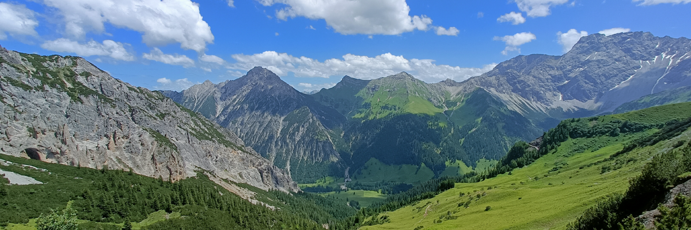

# Week 4: Upland Landscapes

For the rest of the module, we are now shifting from considering the broad processes like weathering, erosion, transport, and deposition in general, to looking at how they combine to shape landscapes in particular settings. This week, we will consider the processes operating in upland landscapes, and how such landscapes evolve through time.

By the end of this week you should be able to:
1. Explain the main processes operating in upland landscapes
2. Describe the general properties of upland sediments
3. Explain the concept of landscape maturity

This section will contain lecture slides and the assigned reading for the week.

- [ ] Lecture
- [ ] Lab - Group 2A
- [ ] Reading - Huggett chapter 8
- [ ] Additional reading - Papers by Amine et al. 2020, and Bishop 2007

## Lecture

Lecture Monday 0900-1000, C1-059

Lecture slides: [GY4027 L4 Upland Landscapes](./assets/lectures/GY4027_L4_Upland_Landscapes.pdf)

## Labs

LAB GROUP 2A: Friday 1400-1600 in ER2-029

## Reading

### Module textbook

I would like you to read Chapter Eight of Huggett, R. (2017) Fundamentals of Geomorphology, 4th Edition. Routledge, London.

Chapter Eight is the chapter on hillslopes - don't worry about the mathsy bits, it's the general concepts that are important.

Available [online](https://archive.org/details/routledgefundamentalsofphysical/) or via the Glucksman Library.

### Academic papers

*Every week I'll also be giving you at least one paper from an academic journal to read. These papers will extend beyond the content of the lecture, giving examples of applying the principles we're discussing. You have to get used now to reading beyond the topic of the lecture - remember, 6 credits equates to 120 hours of work over the semester, of which you get 11 hours of lectures, and 10 hours of labs. That leaves 99 hours of independent work, approximately 8 hours per week. The lectures should be an introduction - even the reading I assign should just be an extended introduction.*

- Amine, A., El Ouardi, H., Zebari, M., El Makrini, H., and Habibi, M. 2020. Relative landscape maturity in the South Rifian Ridges (NW Morocco): Inferences from DEM-based surface indices analysis. *Applied Computing and Geosciences* **100027**. doi: [10.1016/j.acags.2020.100027](https://doi.org/10.1016/j.acags.2020.100027)

This paper is an example of using geospatial techniques to look at upland landscapes.

- Bishop, P. 2007. Long-term landscape evolution: linking tectonics and surface processes. *Earth Surface Processes and Landforms*, **32**, 329-365. doi: [10.1002/esp.1493](https://doi.org/10.1002/esp.1493)

This review paper covers some of the key techniques in landscape evolution, and the interplay between the tectonic processes (driving uplift) and surface processes (which we covered in the first 3 lectures).

### Optional additional reading

One of the formative papers in this topic is

- Hack, J.T. (1960). Interpretation of erosional topography in humid temperate regions. *American Journal of Science* **258**, 80–97 [download pdf](https://earth.geology.yale.edu/~ajs/1960/ajs_258A_11.pdf/80.pdf).

John Hack challenged the prevailing Davisian "Cycle of Erosion" proposed by W.M. Davis (1899). While Davis envisioned landscapes aging from "Youth" to "Old Age" (peneplain) following uplift, Hack argued that landscapes rapidly adjust so that erosion balances uplift: dynamic equilibrium. It's an older paper of course, but bearing in mind that there's been 60 years of research since this was pubished, it can give you an idea of the core concepts and where the field developed from.

On a different note, while the Bishop (2007) paper gives a good review of the interplay of tectonics and surface processes, there's also some interesting work such as 

- Zeitler, P.K., Meltzer, A.S., Koons, P.O., Craw, D., Hallet, B., Chamberlain, C.P., Kidd, W.S.F., Park, S.K., Seeber, L., Bishop, M., and Shroder, J. 2001 Erosion, Himalayan geodynamics, and the geomorphology of metamorphism. *GSA Today* **11**, 4–9  [download pdf](https://rock.geosociety.org/gsatoday/archive/11/1/pdf/i1052-5173-11-1-4.pdf)

which shows that, rather than the obvious "tectonics pushes the land up, rivers erode it down", erosion by rivers can actually help drive deep tectonic processes.