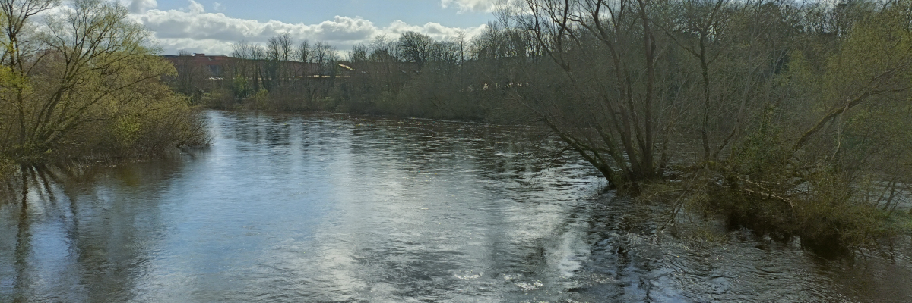

# Week 5: Fluvial Landscapes

This week, we will look at landscapes shaped by rivers.

By the end of this week you should be able to:
1. Explain the main processes operating in fluvial landscapes
2. Describe the general properties of fluvial sediments
3. Explain the contribution of fluvial systems to landscape maturity

This section will contain lecture slides and the assigned reading for the week.

- [ ]  Lecture
- [ ]  Lab - Group 2B
- [ ]  Reading - Huggett chapter 9
- [ ]  Additional reading - papers by Fremier et al. (2018) and Perez-Arlucea and Smith (1999)

## Lecture

Lecture Monday 0900-1000, C1-059

Lecture slides: [GY4027 L5 Fluvial Landscapes](./assets/lectures/GY4027_L5_Fluvial_Landscapes.pdf)

## Labs

LAB GROUP 2B: Friday 1100-1300 in ER2-029

## Reading

### Module textbook

I would like you to read Chapter Nine of Huggett, R. (2017) Fundamentals of Geomorphology, 4th Edition. Routledge, London.

Chapter Nine is the chapter on fluvial landscapes.

Available [online](https://archive.org/details/routledgefundamentalsofphysical/) or via the Glucksman Library.

### Academic papers

*Every week I'll also be giving you at least one paper from an academic journal to read. These papers will extend beyond the content of the lecture, giving examples of applying the principles we're discussing. You have to get used now to reading beyond the topic of the lecture - remember, 6 credits equates to 120 hours of work over the semester, of which you get 11 hours of lectures, and 10 hours of labs. That leaves 99 hours of independent work, approximately 8 hours per week. The lectures should be an introduction - even the reading I assign should just be an extended introduction.*

- Fremier, A.K., Yanites, B.J., and Yager, E.M. 2018. Sex that moves mountains: The influence of spawning fish on river profiles over geologic timescales. *Geomorphology* **305**, 163–172. doi: [10.1016/j.geomorph.2017.09.033](https://doi.org/10.1016/j.geomorph.2017.09.033)

This is a rather nice paper that looks at a particular form of biological erosion in rivers. Not something you'd maybe expect to make a big difference, and that's what makes it interesting. Don't try to understand the maths.

- Perez-Arlucea and Smith. 1999. Depositional patterns following the 1870s avulsion of the Saskatchewan River (Cumberland Marshes, Saskatchewan, Canada). *Journal of Sedimentary Research* **69**, 62–73. doi: [10.2110/jsr.69.62](https://doi.org/10.2110/jsr.69.62)

I used a few figures from this paper in the lecture - an interesting example of change in a braided river system in Canada.

### Optional additional reading

One of the most influential papers in river geomorphology is

- Wolman, M.G. and Miller, J.P. 1960 Magnitude and Frequency of Forces in Geomorphic Processes. *The Journal of Geology* **68**, 54–74 [download pdf](http://geomorphology.sese.asu.edu/Papers/Wolman_and_Miller_1960.pdf)

which used streamflow data to show that while catastrophic floods are impressive, it is actually the more moderate flows which occur often enough (every 1–2 years) to transport the vast majority of sediment over the long term. Essentially, this paper explains why rivers look the way they do.
