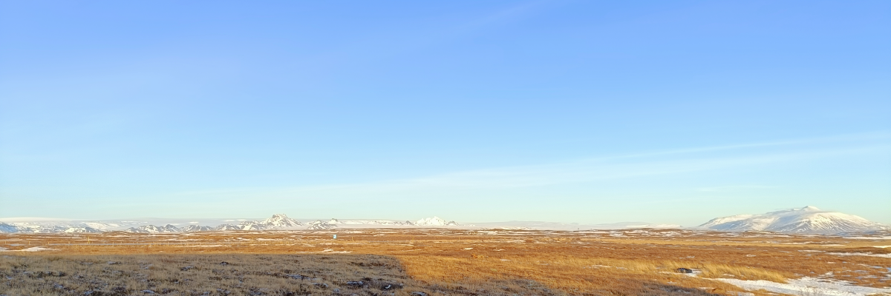

# Week 6: Glacial Landscapes

This week, we will look at landscapes carved by glaciers.

By the end of this week you should be able to:
1. Explain the main processes operating in glacial landscapes
2. Describe the general properties of glacial sediments
3. Describe the formation of common glacial geomorphological features

This section will contain lecture slides and the assigned reading for the week.

- [ ]  Lecture
- [ ]  Lab - Group 2A
- [ ]  Reading - Huggett chapters 10-11
- [ ]  Additional reading - paper by Kirkbride and Matthews (1997)

## Lecture

Lecture Monday 0900-1000, C1-059

Lecture slides: [GY4027 L6 Glacial Landscapes](./assets/lectures/GY4027_L6_Glacial_Landscapes.pdf)

## Labs

LAB GROUP 2A: Friday 1400-1600 in ER2-029

## Reading

### Module textbook

I would like you to read Chapter Ten and Chapter Eleven of Huggett, R. (2017) Fundamentals of Geomorphology, 4th Edition. Routledge, London.

Describe the formation of common glacial geomorphological features

Available [online](https://archive.org/details/routledgefundamentalsofphysical/) or via the Glucksman Library.

### Academic papers

*Every week I'll also be giving you at least one paper from an academic journal to read. These papers will extend beyond the content of the lecture, giving examples of applying the principles we're discussing. You have to get used now to reading beyond the topic of the lecture - remember, 6 credits equates to 120 hours of work over the semester, of which you get 11 hours of lectures, and 10 hours of labs. That leaves 99 hours of independent work, approximately 8 hours per week. The lectures should be an introduction - even the reading I assign should just be an extended introduction.*

- Kirkbride, M. and Matthews, D. 1997. The Role of Fluvial and Glacial Erosion in Landscape Evolution: The Ben Ohau Range, New Zealand. *Earth Surface Processes and Landforms* **22**, 317–327. doi: [10.1002/(SICI)1096-9837(199703)22:3%3C317::AID-ESP760%3E3.0.CO;2-I](https://doi.org/10.1002/(SICI)1096-9837(199703)22:3%3C317::AID-ESP760%3E3.0.CO;2-I)

This is a nice example of the kind of analysis geomorphologists do on glacial landscapes - in particular, here, on a New Zealand landscape with ongoing uplift. Worth a read.

### Optional additional reading

This paper is quite long and goes far more into physics than is useful for you, but it also gives a nice review of the historic development of understanding of how glaciers flow.

- Fowler, A.C. 2024 Glacier and ice sheet flow. *Geophysical & Astrophysical Fluid Dynamics* **118**, 251–386. [10.1080/03091929.2024.2346588](https://doi.org/10.1080/03091929.2024.2346588)