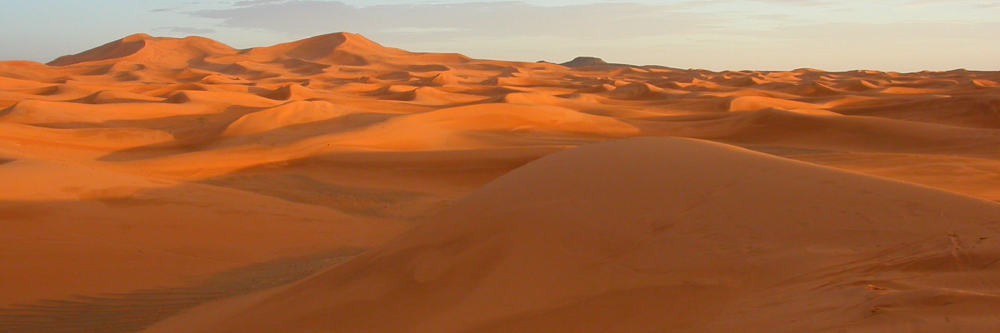

# Week 8: Aeolian Landscapes

This week, we will explore landscapes shaped by aeolian processes - the wind.

By the end of this week you should be able to:
1. Explain the main processes operating in arid landscapes
2. Describe the general properties of aeolian sediments
3. Describe common aeolian landforms and geomorphological features

This section will contain lecture slides and the assigned reading for the week.

- [ ]  Lecture
- [ ]  Lab - Group 2A
- [ ]  Reading - Huggett chapters 12
- [ ]  Additional reading - papers by Herzog *et al.* (2021) and Delgado-Fernandez and Davidson-Arnott (2011)

## Lecture

Lecture Monday 0900-1000, C1-059

Lecture slides: [GY4027 L8 Aeolian Landscapes](./assets/lectures/GY4027_L8_Aeolian_Landscapes.pdf)

## Labs

LAB GROUP 2A: Friday 1400-1600 in ER2-029

## Reading

### Module textbook

I would like you to read Chapter 12 of Huggett, R. (2017) Fundamentals of Geomorphology, 4th Edition. Routledge, London.

This is the chapter on aeolian landscapes.

Available [online](https://archive.org/details/routledgefundamentalsofphysical/) or via the Glucksman Library.

### Academic papers

*Every week I'll also be giving you at least one paper from an academic journal to read. These papers will extend beyond the content of the lecture, giving examples of applying the principles we're discussing. You have to get used now to reading beyond the topic of the lecture - remember, 6 credits equates to 120 hours of work over the semester, of which you get 11 hours of lectures, and 10 hours of labs. That leaves 99 hours of independent work, approximately 8 hours per week. The lectures should be an introduction - even the reading I assign should just be an extended introduction.*

- Herzog, M., Henselowsky, F., and Bubenzer, O. 2021. Geomorphology of the Tafilalt Basin, South-East Morocco – implications for fluvial–aeolian dynamics and wind regimes. *Journal of Maps* **17**, 682–689. doi: [10.1080/17445647.2021.1990805](https://doi.org/10.1080/17445647.2021.1990805)

Nice mapping paper about the region of Morocco which includes the Erg Chebbi dune field, of which there's a few photos in the lecture.

- Delgado-Fernandez, I. and Davidson-Arnott, R. 2011. Meso-scale aeolian sediment input to coastal dunes: The nature of aeolian transport events. *Geomorphology* **126**, 217–232. doi: [10.1016/j.geomorph.2010.11.005](https://doi.org/10.1016/j.geomorph.2010.11.005)

A really nice paper looking at aeolian transport in a coastal dune system in Canada.

