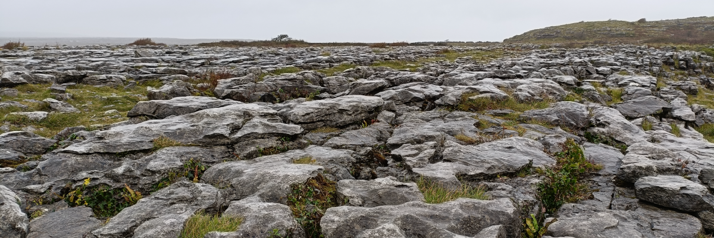

# Week 9: Karst Landscapes

This week, we will look at limestone landscapes shaped by water.

By the end of this week you should be able to:
1. Describe the main processes operating in Karst landscapes
2. Explain the evolution of Karst landscapes
3. Give examples of Karst landscape features

This section will contain lecture slides and the assigned reading for the week.

- [ ]  Lecture
- [ ]  Lab - Group 2B
- [ ]  Reading - Huggett chapter 14
- [ ]  Additional reading - papers by Benac *et al.* (2013) and Simms (2004)

## Lecture

Lecture Monday 0900-1000, C1-059

Lecture slides: [GY4027 L9 Karst Landscapes](./assets/lectures/GY4027_L9_Karst_Landscapes.pdf)

## Labs

LAB GROUP 2B: Friday 1100-1300 in ER2-029

## Reading

### Module textbook

I would like you to read Chapter 14 of Huggett, R. (2017) Fundamentals of Geomorphology, 4th Edition. Routledge, London.

This is the chapter on karst landscapes.

Available [online](https://archive.org/details/routledgefundamentalsofphysical/) or via the Glucksman Library.

### Academic papers

*Every week I'll also be giving you at least one paper from an academic journal to read. These papers will extend beyond the content of the lecture, giving examples of applying the principles we're discussing. You have to get used now to reading beyond the topic of the lecture - remember, 6 credits equates to 120 hours of work over the semester, of which you get 11 hours of lectures, and 10 hours of labs. That leaves 99 hours of independent work, approximately 8 hours per week. The lectures should be an introduction - even the reading I assign should just be an extended introduction.*

- Benac, C., Juračić, M., Matičec, D., Ružić, I., and Pikelj, K. 2013. Fluviokarst and classical karst: Examples from the Dinarics (Krk Island, Northern Adriatic, Croatia). *Geomorphology* **184**, 64–73. doi: [10.1016/j.geomorph.2012.11.016](https://doi.org/10.1016/j.geomorph.2012.11.016)

This is a look at a Croatian island with two different karst landscapes. Comparing the two is an interesting look at the influences on karst development.

- Simms, M.J. 2004. Tortoises and hares: dissolution, erosion and isostasy in landscape evolution. *Earth Surface Processes and Landforms* **29**, 477–494. doi: [10.1002/esp.1047](https://doi.org/10.1002/esp.1047)

This isn't strictly about karst - it discusses limestone erosion, but is a much broader discussion on landscape evolution, with a significant focus on Ireland.

### Optional additional reading

If it looks like karst...is it karst? Or does it have to be formed like karst?

- Halliday, W.R. 2007 Pseudokarst in the 21st century. *Journal of Cave and Karst Studies* **69**, 103-113. [download pdf](https://caves.org/wp-content/uploads/Publications/JCKS/v69/cave-69-01-103.pdf)